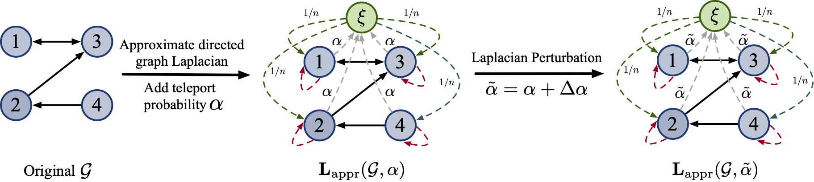
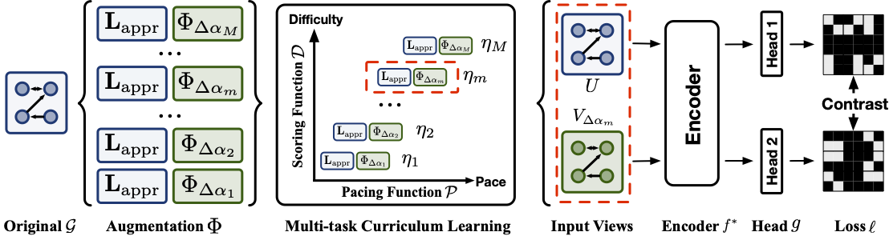

# Directed Graph Contrastive Learning

**[Paper](https://proceedings.neurips.cc/paper/2021/file/a3048e47310d6efaa4b1eaf55227bc92-Paper.pdf)** | **[Poster](https://github.com/flyingtango/DiGCL/blob/main/docs/digcl_poster.pdf)** | **[Supplementary](https://github.com/flyingtango/DiGCL/blob/main/docs/digcl_supp.pdf)** 

The PyTorch implementation of Directed Graph Contrastive Learning (DiGCL).

In this paper, we present the first contrastive learning framework for learning directed graph representation.


<center>Illustration of Laplacian perturbation</center>
<center></center>

&nbsp;
<center>Illustration of DiGCN model using Laplacian perturbation</center>
<center></center>
&nbsp;


If you find our work useful, please considering citing

```
@article{tong2021directed,
  title={Directed Graph Contrastive Learning},
  author={Tong, Zekun and Liang, Yuxuan and Ding, Henghui and Dai, Yongxing and Li, Xinke and Wang, Changhu},
  journal={Advances in Neural Information Processing Systems},
  volume={34},
  year={2021}
}
```


## Requirements

Our project is developed using Python 3.7, PyTorch 1.7.0 with CUDA10.2. We recommend you to use [anaconda](https://www.anaconda.com/) for dependency configuration.

First create an anaconda environment called `DiGCL` by

```shell
conda create -n DiGCL python=3.7
conda activate DiGCL
```

Then, you need to install torch manually to fit in with your server environment (e.g. CUDA version). For the torch and torchvision used in my project, run

```shell
conda install pytorch==1.7.0 torchvision==0.6.0 cudatoolkit=10.2 -c pytorch
```

Besides, torch-scatter and torch-sparse are required for dealing with sparse graph.
For these two packages, please follow their official instruction [torch-scatter](https://github.com/rusty1s/pytorch_scatter) and [torch-sparse](https://github.com/rusty1s/pytorch_sparse).

Other requirements can be set up through:

```shell
cd DiGCL
pip install -e .
```

## Usage

```shell
cd code
python train_digcl.py --gpu_id 0 --dataset cora_ml --curr-type log
python train_digcl.py --gpu_id 0 --dataset citeseer
```

The `--dataset` argument can be one of [cora_ml, citeseer] and the `--curr-type` argument can be one of [linear, log, exp, fixed].

## License

DiGCL is released under the MIT License. See the LICENSE file for more details.


## Useful Links

We are grateful for the following enlightening works, which are also of great use in our work.
* Graph Contrastive Learning Library for PyTorch: [PyGCL](https://github.com/GraphCL/PyGCL)
* Graph Contrastive Learning with Adaptive Augmentation: [GRACE](https://github.com/CRIPAC-DIG/GRACE) and [GCA](https://github.com/CRIPAC-DIG/GCA)
* Graph Contrastive Learning with Augmentations: [GraphCL](https://github.com/Shen-Lab/GraphCL)
* Our another supervised approach to process directed graphs:  [DiGCN](https://github.com/flyingtango/DiGCN)
* MagNet: A Neural Network for Directed Graphs: [MagNet](https://github.com/matthew-hirn/magnet)

## Acknowledgements

The template is borrowed from Pytorch-Geometric benchmark suite. We thank the authors of following works for opening source their excellent codes.
[Pytorch-Geometric](https://github.com/rusty1s/pytorch_geometric), [Graph2Gauss](https://github.com/abojchevski/graph2gauss), and [GNN-benchmark](https://github.com/shchur/gnn-benchmark).
